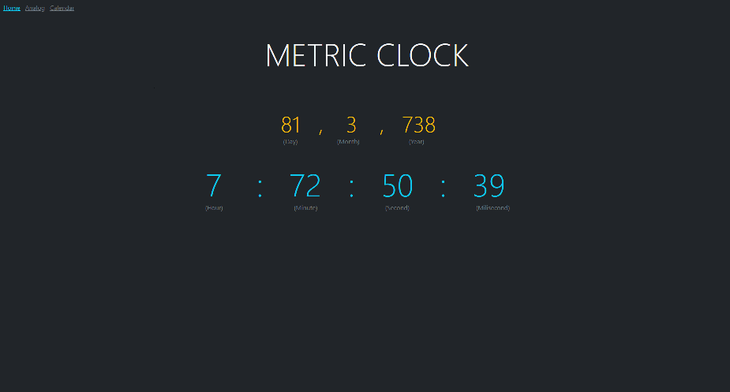
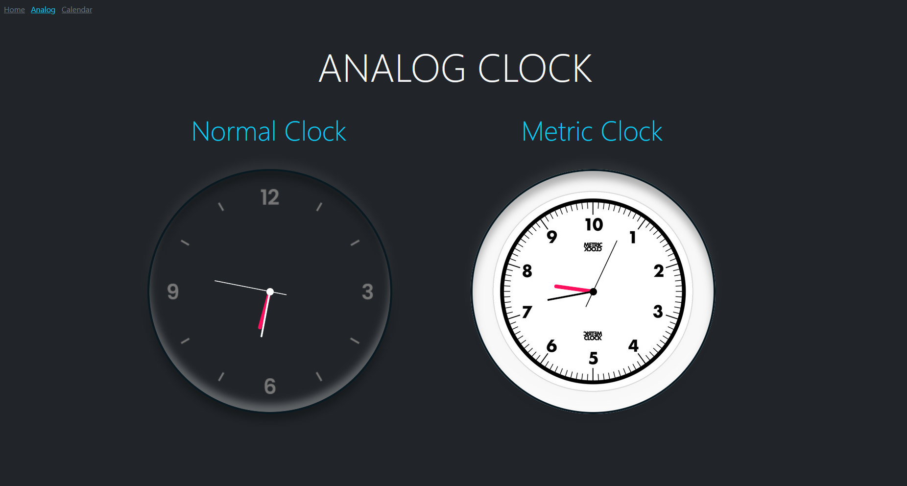
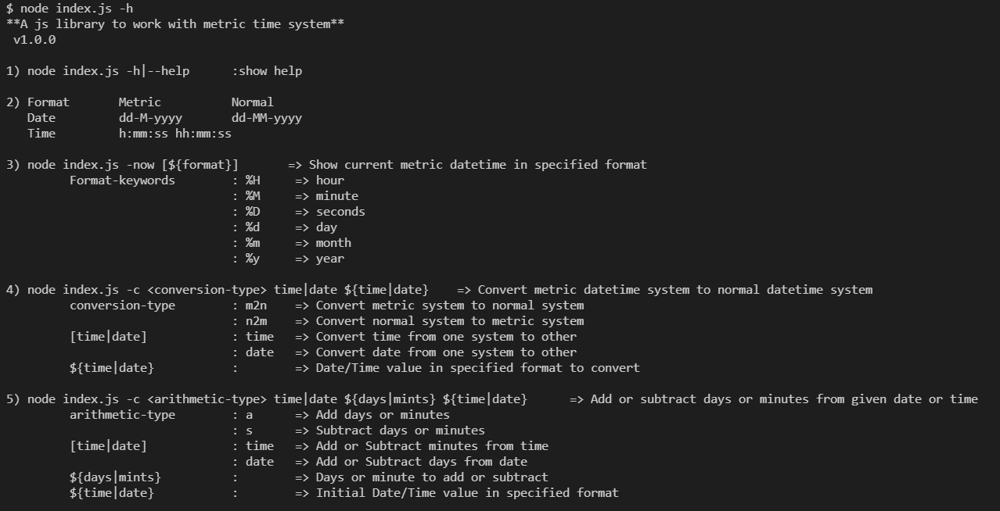

# Metric-Clock
A clock to tell time in metric(10) system


## Table of Contents
- [Technologies](#technologies)
- [Screenshots](#screenshots)
- [Contributors](#contributors)


## Technologies
- HTML
- Bootstrap


## Publishing
1. Create new tag and release
2. Publishing of package is done automatically by `./.github/workflows/npm-publish.yml` action.

There's no need to build anything since its javascript library. 
Testing packing locally, you can run:
```shell script
npm pack
```


## Screenshots
Some screenshots of the program:-
- *Home*<br />

- *Analog*<br />

- *Library*<br />



## Contributors
@SKR301- [Saurav Kumar](https://github.com/SKR301) <br/>
@Norkator- [Martin Kankaanranta](https://github.com/norkator) <br/>
@Akshay- [Akshay Parmar](https://github.com/Akshayaap) <br/>
